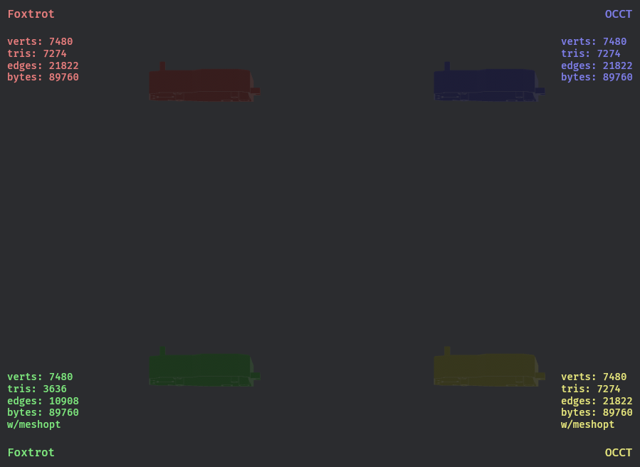

# bevy_step_loader

A Bevy plugin that adds support for loading STEP and STP files as Bevy Mesh assets.


# Why?
Well, .STEP is a boundary representation, so unlike .gltf or .ojb there is no 'Mesh' there is no list of verticies, edges and the faces they make up, instead geometry is defined by the simplest definitions possible, for example a `circle` would have a 
`position`, probably `x,y,z` and a `radius` of say, `2`. 

Which is very different from a circle made up of a mesh, which will have as many edges as you thought kept it looking pretty much 'circular' and so on.

Most CAD packages can export to `.obj` and `.gltf` etc, but that assumes you have access to one, onshape is free, but _only_ if you make your .STEP data public.

If you're wondering `.STEP` files are _**NOT**_ supported natively by popular modelling tools like blender (because they're a very different kind of geometric representation probably...).

So that's why.

> P.S if you want a blender plugin that does just that -> https://alphastrata.gumroad.com/l/step2blender I made one using the same libraries that _this_ plugin uses.

## Features

- Load STEP files directly into Bevy scenes as meshes
- Support for multiple triangulation backends
- Optional mesh optimisation using meshopt
- Asynchronous asset loading
- Mesh simplification for performance optimisation

## Triangulation Backends

This crate supports two different triangulation engines with different trade-offs:

### Foxtrot (Default)
- **Pros**: Pure Rust implementation, faster STEP parsing and triangulation, smaller binary size
- **Cons**: Less robust triangulation, particularly with complex geometries and NURBS surfaces
- **wasm**: Naturally this is easier to use in `wasm` builds

### [OpenCascade (OCCT) - Optional Feature](https://github.com/CadQuery/cadquery)
- **Pros**: More robust triangulation, better handling of complex geometries and NURBS, well-established tooling
- **Cons**: C++ wrapper dependency, slower triangulation, larger binary size

## Prerequisites

For the OpenCascade backend, you need a C++ library to link into, so install some `libstdc++`:

```sh
sudo apt update
sudo apt install libstdc++-12-dev
```
> NOTE: best see _their_ docs for any deps etc, https://github.com/bschwind/opencascade-rs

## Usage

### Basic Usage (with default Foxtrot backend)

```rust
use bevy::prelude::*;
use bevy_step_loader::{StepAsset, StepPlugin};

fn main() {
    App::new()
        .add_plugins((
            DefaultPlugins,
            StepPlugin,
        ))
        .add_systems(Startup, setup)
        .run();
}

fn setup(asset_server: Res<AssetServer>) {
    // Load a STEP file (using a file present in your assets directory)
    let step_handle: Handle<StepAsset> = asset_server.load("22604_bcab4db9_0001_2.step");
    
    // The STEP file will be automatically triangulated and available as a mesh
    println!("Loading STEP file...");
}
```

- Thanks to `meshopt` you can decimate the Asset. (make its mesh simpler, useful for use in game engines.)
```rust
    // get your asset from asset server like one normally would...
    step_asset.simplify_mesh(0.5, 0.01);
    // do stuff
```

### Using OpenCascade Backend

To use the OpenCascade backend for more... robust triangulation:

```toml
[dependencies]
bevy_step_loader = { git = "https://github.com/alphastrata/bevy_step_loader", features = ["opencascade"] }
```

### Enabling Mesh Optimisation

To enable vertex cache optimisation for better rendering performance:

```toml
[dependencies]
bevy_step_loader = { git = "https://github.com/alphastrata/bevy_step_loader", features = ["meshopt"] }
```
> NOTE: maybe via cargo after I've confirmed it's working...

## Supported File Extensions

- `.step`
- `.stp`
- `.STEP`
- `.STP`

## Examples
>Just one...

- `usage.rs` - Comprehensive example showing all configurations with visualisation


## Features

- `opencascade`: Enable OpenCascade backend for more robust triangulation
- `meshopt`: Enable mesh optimisation and simplification using meshopt crate

## Included step files:
Sourced from https://github.com/AutodeskAILab/BRepNet/tree/master/example_files/step_examples, [licensed CC].(http://creativecommons.org/licenses/by-nc-sa/4.0/)

For example purposes only.
